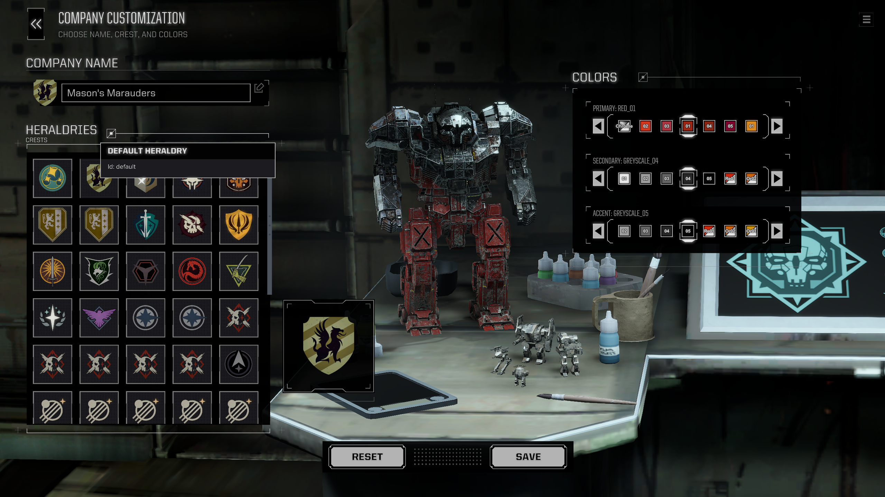

# Heraldry Picker

This quality-of-life mod for BattleTech improves the Company Customization screen with two key features:

1. **Heraldry Picker:** Adds a dedicated "Heraldries" tab to the existing crest selection menu that lets you browse, preview, and instantly apply all faction heraldries available in the game (vanilla and modded).
2. **Color ID Helper:** Adds the actual color ID names right onto the swatches in the color selection menu. This is particularly useful for modders creating new `HeraldryDef` files, as it lets them quickly find the right color IDs.

> [!TIP]
> For non-modders, each faction and unit in BattleTech has its own `HeraldryDef` file that defines its color scheme and emblem (crest). You can find a guide [here](https://steamcommunity.com/sharedfiles/filedetails/?id=2638707115) on how to edit them.

